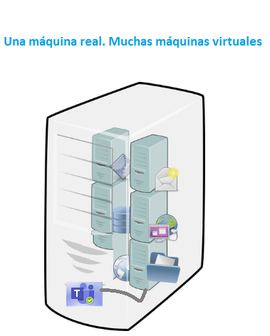
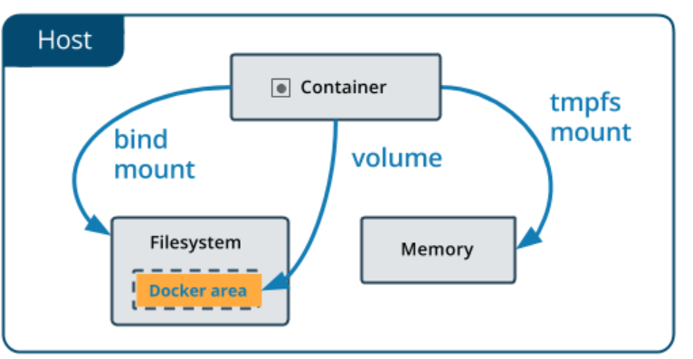

## Problemas del desarrollo de software profesional


### Construir

Escribir código es sólo una parte de construir software, los problemas complejos necesitan equipos. En equipos grandes hay inconvenientes en las versiones, compartir código etc.

	-	Entorno de desarrollo
	-	Dependencias
	-	Entorno de ejecución
	-	Equivalencia con entorno productivo
	-	Servicios externos


### Distribuir

Tu código tiene que transformarse en un artefacto, o varios, que pueden ser transportados a donde tengan que ser ejecutados.

	-	Divergencia de repositorios
	-	Divergencia de artefactos
	-	Versionado


### Ejecutar

La máquina donde se escribe el software siempre es distinta a la máquina donde se ejecuta de manera productiva.

	-	Compatibilidad con el entorno productivo
	-	Dependencias
	-	Disponibilidad de servicios externos
	-	Recursos de hardware


Docker te permite **Construir**, **distribuir**, y **ejecutar** cualquier aplicación en cualquier lado.


## Virtualización

Versión virtual de algún recurso tecnológico, como hardware, un sistema operativo, un dispositivo de almacenamiento o recurso de red. 

Nos permite atacar en simultáneo los tres problemas del desarrollo de software profesional.





### Problemas de las VMs

**Peso**: En el orden de los GBs. Repiten archivos en común. Inicio lento.

**Costo de administración**:  Necesita mantenimiento igual que cualquier otra computadora.

**Múltiples de formatos**: VDI, VMDK, VHD, raw, etc.


Docker utiliza contenedores para evitar estos problemas. El empleo de contenedores para construir y desplegar software.

Ventajas:

	-	Flexibles
	-	Livianos
	-	Portables
	-	Bajo acoplamiento
	-	Escalables
	-	Seguros


Docker es una plataforma que permite construir, ejecutar y compartir aplicaciones mediante contenedores.


El corazón de Docker se le llama **server** o el **docker daemon**. Para exponer los contenedores docker utiliza una ```REST API```, y cuando instalamos Docker viene con una **CLI** para poder interactuar con este.

Docker cuenta con cuatro componentes principales y estos son:

- ```Container```: Los contenedores son donde corren nuestros aplicativos.
- ```Image```: Las imágenes son los recursos que descargamos de  [hub docker](https://hu.docker.com) (repositorio de imagenes de docker) para crear nuestro contenedores.
- ```data volumes```: Este recurso nos permite interactuar con los archivos del sistema donde esta corriendo docker de manera segura.
- ```network```: Interfaz por el cual docker permite interactuar con otros contenedores o exponer los contenedores fuera de docker.


## Primeros pasos con Docker


Una vez instalado Docker podemos verificar si se a instalado de manera correcta tecleando en una terminal o linea de comandos el siguiente comando. 

```dockerfile
docker version
```

Con este comando verificamos la versión de docker que se instalo.

Si necesitamos un poco mas de información podemos usar el comando ```docker info```.


Corremos nuestro primero contenedor llamado ```hello-world```

```dockerfile
docker run hello-world
```

Con esto corremos el contenedor, docker revisa si tenemos la imagen en local si no lo descargara de [hub docker](https://hub,docker.com/).


## Conceptos fundamentales de Docker: contenedores


Es como una maquina virtual liviana, mas ágil y mas rápido. Es una agrupación de procesos que corre nativamente en la maquina(aunque corre en windows y macOS, solo en linux corre de manera nativa) y que están aislados del resto del sistema, un contenedor es una agrupación lógica, por eso puede correr de madera nativa en la maquina anfitriona.

Son limitadas en acceso a la maquina anfitriona, a menos que explícitamente se le indique lo contrario.


## Comprendiendo el estado de Docker

```dockerfile
$ docker run hello-world # corre el contenedor hello-world
$ docker ps # muestros los contenedores activos
$ docker ps --all # muestra todos los contenedores

$ docker inspect <ID_contenedor> # muestra información de un contendor especifico
$ docker inspect <name> # muestra información de un contendor especifico llamado por su nombre o alias

$ docker run --name hello-platzi hello-world # se le asigna un nombre custom al contenedor
$ docker rename hello-platzi hola-platzi # cambiando el nombre de un contenedor
$ docker rm hello-platzi # borrando un contenedor, con el nombre o el ID
$ docker container prune # borrar todos los contenedores parados

```


## Modo interactivo en Docker

Para entrar en este modo en Docker podemos usar ```docker run -it ubuntu```

*	```-i```: Indicamos que sera interactivo
*	```-t```: Abre el TTY (consola)

## Ciclo de vida de un contenedor

Cuando se corre un contenedor lo que se ejecuta es un proceso del sistema operativo. Este proceso llamado ```main process``` es el que determina si ese proceso sigue vivo o no en función si esta funcionando o no el contenedor.

Un contenedor corre siempre y cuando su proceso principal este corriendo, cuando tecleamos ```exit``` en nuestro contenedor en modo **interactivo** apagamos el proceso principal entonces se apaga el contenedor.

Si queremos correr un contenedor de manera que no se apague a menos que explícitamente se haga o le suceda algo al computador podemos utilizar el siguiente comando.

```dockerfile
docker run --name alwaysup --detach ubuntu tail -f /dev/null
```

Con esto creamos un contenedor y se queda activo, solo se apagara de manera explicita.

​	* ```/dev/null```: Conocido como un agujero negro, es decir ese archivo es la nada

Para acceder a este contenedor usamos lo siguiente:

``` dockerfile
docker exec -it alwaysup bash
```


* 	```exec```: Nos permite en un contenedor que ya existe ejecutar un comando o un proceso.
* 	```bash```: Se abre en un shell para interactuar.


Para poder matar el proceso principal de un contenedor podemos usar el siguiente comando.

```dockerfile
docker inspect --format '{{.State.Pid}}' alwaysup
```

 * ```inspect```: Para mostrar información de un contenedor
 * ```--format '{{.State.Pid}}'```: Filtramos el id de un contenedor especifico.

Lo siguiente es teclear ```kill -9 <Pid>```, con esto matamos el proceso principal de un contenedor.


## Exponiendo contenedores

Creamos un servicio proxy en este caso ```Nginx``` que es uno de los mas populares.

```dockerfile
docker run -d --name proxy ngnix
```

* ```-d```: Es la abreviación de **--detach**, esto hace que no se vincula un standar input y standar output a nuestro contenedor y lo corre en **Background**


Con esto creamos un servicio en background en el puerto 80; sin embargo este es el puerto que utiliza dentro del contenedor por lo tanto no esta expuesto a otros contenedores o al exterior, para exponerlo hacemos lo siguiente.

Primero paramos el contenedor creado ```docker stop proxy```

Seguido borramos el contenedor ```docker rm proxy```

Ahora creamos el contenedor exponiéndolo fuera de su propio contenedor y así utilizarlo en nuestra maquina.

```dockerfile
docker run --name proxy -p 8080:80 ngnix
```

	*	```-p 8080:80```: Es la abreviación de **publish**, el argumento para este flag se divide en dos separado por los dos puntos, el lado izquierdo es el puerto donde estará expuesto el servicio en la maquina anfitriona, la parte derecha es el puerto que se va a exponer del contenedor.

Este servicio corre en background, si queremos ver los logs de este servicio usamos el comando ```docker logs proxy```, si necesitamos seguir los logs en tiempo real usamos ```docker logs -f proxy```, con este hacemos follow al servicio.

En caso que necesitamos solo una cierta cantidad de últimos logs usamos el flag --tail de la siguiente manera: ```docker logs --tail 10 -f proxy```, con eso vemos solo los últimos 10 logs del servicio.


## Bind mounts

Los contenedores son autocontenidos, no pueden acceder a otros contenedores ni a la máquina anfitriona a menos que se lo permitamos.

Si borramos un contenedor la información no se conserva, eso no es muy útil para eso hacemos lo siguiente.

Creamos el directorio que queremos montar en el contenedor ```mkdir mongodata```

```shell
docker run -d --name db-mongo -v /platzi/docker/dockerdata/mongodata:/data/db mongo
```

* ```-v```: Con este flag indicamos que haremos un **Bind mounts**, le pasamos dos parámetros separados por los dos puntos, el que esta en la parte izquierda indica el directorio de la maquina anfitriona que vamos a montar, el del lado derecho es el directorio donde se va a montar.

Con esto tendremos persistencia de datos, aunque borremos el contenedor todo los datos quedaran grabados en el directorio montado de la maquina anfitriona, después si queremos ver los datos creamos un contenedor montando este directorio así seguiremos con nuestros datos.


## Volúmenes

Docker nos ofrece otras maneras de manejar datos distinto a **Bind mounts**, estos son los volúmenes que docker desarrollo para darle mas seguridad a los archivos y directorios.

La parte de los volúmenes en el disco lo maneja exclusivamente docker a  menos que seamos usuarios privilegiados. Esto es mas practico a la hora de disponer un lugar donde docker va almacenar  los datos y que nadie puede tocar excepto docker, esto nos ayuda a ser mas ordenados.

* ```docker volume ls```: Para ver si tenemos volúmenes en docker.
* ```docker volume create db-mongo```: Creamos un volumen.

Ahora creamos un contenedor y montamos este volumen.

```dockerfile
docker run -d --name db-mongo --mount src=db-mongo,dst=/data/db mongo
```

* ```--mount```: Con este flag indicamos que vamos a montar un volumen, este necesita dos parámetros que le indicamos uno con ```src``` que es el nombre del volumen a montar si este  no esta creado docker lo crea por nosotros, el otro parámetro lo indicamos con ```dst``` este es donde vamos a montar el volumen dentro de nuestro contenedor. estos los parámetros los separamos por una coma ```(,)```.


## Insertar y extraer archivos de un contenedor

Podemos extraer e insertar archivos desde la maquina local a un contenedor.

```dockerfile
docker cp prueba.txt copytest:/testing/test.txt
```


* ```cp```: Flag con el que copiamos un archivo a un contenedor con los siguientes parámetros: Seguido del flag **cp** indicamos el nombre o ruta del archivo a copiar, después indicamos el nombre del contenedor donde se copiara, dos puntos ```(:)``` seguido de la ruta interna del contenedor donde se copiara el archivo.

Con esto copiamos un archivo de nuestro sistema a un contenedor.

Si se requiere realiza la operación contraria lo que debemos de realizar es invertir los parámetros del flag **cp**. Esto significa  que el primer  parámetro  es lo que vamos a copiar y el del lado derecho a donde lo vamos a copiar.

```dockerfile
docker cp copytest:/testing localtesting
```


Docker nos permite interactuar de maneras distintas con los archivos de la maquina local, con **Bind mounts** montamos un directorio especifico en un lugar especifico dentro del contenedor, este método tiene un defecto y es que solo podemos ver la información si creamos un contenedor montamos el directorio y accedemos al contenedor.


Otra manera mas segura es crear volúmenes en docker y luego este volumen se monta a un contenedor. Este método es mas seguro porque el volumen solo lo puede manejar docker o usuarios con permisos privilegiados.

También contamos con el flag **cp** que nos permite copiar archivos o directorios de la maquina local al interior de un contenedor o viceversa.

Hay otra opción llama ```tmpfs```, este método solo esta disponible en sistemas linux, este es una porción de disco que esta disponible solo en memoria dentro del contenedor. Este información se borra en cuanto el contenedor se borra.





## Conceptos fundamentales de Docker: Imágenes

Las imagenes son los moldes o schemas a partir del cual Docker crea los contenedores.

Para ver las imagenes que tenemos en local, tecleamos

```dockerfile
docker image ls
```

Una imagen es un conjunto de archivos o capas. Esto es para distribuir con eficiencia entre los distintos sistemas operativos la imagen.

Para descargar una imagen a nuestro computador usamos ```docker pull <nombre_imagen>```, si no indicamos la versión especifica de la imagen Docker asume que requerimos la ultima versión.

Si necesitamos una versión especifica de una imagen usamos la siguiente sintaxis: ```docker pull ubuntu:20.04```. Separamos con los dos puntos ```(:)``` el nombre de la imagen y la version de la imagen que requerimos.


## Construyendo una imagen propia

Creamos un archivo ```Dockerfile```, luego configuramos nuestra imagen en el archivo creado anteriormente.

```dockerfile
FROM ubuntu:latest

RUN touch /usr/src/hola-platzi:txt
```

* ```FROM```: Indicamos de que imagen va a depender nuestra imagen personalizada.
* ```RUN```: Es lo que va a realizar nuestra imagen.

En este caso la imagen creada un archivo con el comando ``touch`` en la dirección que le pasemos, todo lo que indiquemos que hará la imaginen este lo hará en tiempo de build.

Ya escrito la configuracion de la imagen ejecutamos o corremos el build:

```dockerfile
docker build -t ubuntu:platzi .
```

```build```: Comando con el que se crea la imagen.

```-t```: Flag con el que le agregamos una etiqueta o nombre a nuestra imagen.

Luego le pasamos el contexto del **build**, este es el espacio de disco que tendrá acceso docker a la hora de realizar el build. En este caso le pasamos el punto **(.)** que representa el directorio donde nos encontramos, ahí encuentra el archivo ```Dockerfile``` el que utilizara para crear la imagen.


## El sistema de capas

Para poder observar las capas con las cuales esta formado una imagen podemos utilizar el comando ```docker history <imagen>```, con esto veremos las capas de la imagen, esto es un poco limitado si requerimos ver las capas de modo más profundo podemos utilizar la herramienta ```dive``` que lo podemos encontrar en [dive](https://github.com/wagoodman/dive).

Lo usamos desde la terminal con el comando ```dive <imagen>```, nos abre una ventana en la terminal mostrándonos todas las capas que tiene la imagen, una capa no es más que un cambio que realiza en la imagen.


## Docker networking: colaboración entre contenedores


Docker nos permite crear networking entre contenedores, para poder ver las redes que Docker ya nos ofrece podemos usar el comando ```docker network ls```.

Podemos crear nuestra propia red de la siguiente manera. ```docker network create --attachable <nameNetwork>```:

	*	```network```: Palabra clave para las networking.
	*	```create```: Flag con el que creamos una nueva red.
	*	```--attachable```: Flag con el que le decimos a docker que se pueden conectar desde otros contenedores al nuestro.

Para ver las propiedades de la red creada podemos usar ```docker network inspect <nameNetwork>```.

Para conectar un contenedor a la red creada anteriormente, usamos la siguiente sintaxis ```docker network connect <nameNetwork> <nameContainer>```.


## Docker compose: la herramienta todo en uno

Este es un archivo donde podemos escribir la arquitectura de servicios que nuestra app utilizara, configurar como se va a comunicar o manejar archivos.

Este es un ejemplo de como se ve este archivo.

```yaml
version: "3.8"

services:
	app:
 		image: platziapp
 		environment:
  			MONGO_URL: "mongodb://db:27017/db-mongo"
 		depends_on:                        
			- db-mongo
		ports:
			- "3000:3000"
 
 	db:
 		image: mongo
        
```

	*	```version```: Es la version del docker file, es necesario indicar la versión porque podria no soportar algunas características más recientes.
	*	```services```: Son los servicios que componen a nuestra aplicación pensando en los micro-servicios.
	*	```app```: Indica un servicio que es el que levanta nuestra aplicación.
 *	```image```: Es la imagen del cual depende nuestra app.
 *	```environment```: Indica las variables de entorno que necesita la app para funcionar.
 *	```depends_on```: Indicamos de que otro contenedor depende este mismo, e indica que primero se debe de levantar el contenedor del cual depende de lo contrario no levanta nuestra app.
 *	```ports```: Indicamos en que puerto sera expuesto nuestra app.


Para correr o levantar la app tomando nuestro docker file corremos el siguiente comando ```docker-compose up```.


### Comandos de docker-compose

* ```docker-compose ps```: Lista los contenedores creados con docker-compose.
* ```docker  network ls```: Lista las redes de docker.
* ```docker network inspect docker_default```: Veo definición de la red.
* ```docker-compose logs```:  Veo todos los logs
* ```docker-compose logs app```: Podemos ver los logs de app.
* ```docker-compose logs -f app```: Con el flag ``-f`` hacemos follow de los logs de la app.
* ```docker-compose exec app bash```: Entro al shell del contenedor app. En este caso no es necesario agregar el flag ``-it`` para ingresar al shell, esto es porque se esta utilizando docker-compose.
* ```docker-compose down```: Para detener los contenedores y destruirlos. También elimina la red.


### Docker compose, como herramienta de desarrollo


## Administrando el ambiente de Docker

* ```docker container prune```: Nos ayuda a borrar todos los contenedores que están apagados.
* ```docker ps -q```: Muestra el **id** de los contenedores que están corriendo.
* ```docker rm -f $(docker ps -aq)```:  Con esto borramos a la fuerza todos los contenedores que están corriendo.
* ```docker system prune```:  Con esto docker limpia todo lo que no esta en uso.
* ```docker run -d --name app --memory 1g platziapp```: Creamos un contenedor con el flag ***--memory*** y su argumento de ***1g***. con esto limitamos el uso de memoria de este contenedor.
* ```docker stats```:  Con esto vemos el uso de memoria que esta usando docker y los diferentes contenedores que están corriendo.

## Detener contenedores correctamente: SHELL vs. EXEC

* ```docker stop looper```: Docker envía la señal ***SIGTERM*** para detener el contenedor con el nombre looper.

* ```docker ps -l```: Con el flag ***-l*** ***(latest)***, con este indicamos que nos muestre es estado del ultimo proceso, este o no este corriendo.

  Cuando tengamos un código de salida mayor a 128 es porque Docker forzó la detención del contenedor.

* ```docker kill looper```: Docker envía la señal ***SIGKILL***, para forzar la detención del contenedor.

* ```docker exec looper ps -ef```: Vemos los procesos del contenedor.

Es mas eficiente escribir nuestro Dockerfile con el método ***EXEC*** que con el método ***SHELL***, para escribirlo con el método ***EXEC*** escribimos las sentencias entre corchetes y dobles comillas **ejemplo** ```CMD ["/loop.sh"]```. De esta manera nos aseguramos correr de manera independiente los procesos y no que dependa de otro.

## Contenedores ejecutables: ENTRYPOINT vs CMD

Para poder pasarle parámetros al correr un contenedor y este ejecute el mismo debemos de utilizar una utilizar que se llama ***ENTRYPOINT*** en nuestro Dockerfile.

```dockerfile
FROM ubuntu:trusty
ENTRYPOINT ["/bin/ping", "-c", "3"]
CMD ["localhost"]
```

Con esto podemos pasarle un parámetro a nuestro contenedor. ```docker run --name pinger ping google.com```.

## El contexto de build

El contexto de build se lo pasamos como ultimo parámetro al comando a la hora de realizar el build  de un archivo Dockerfile. ```docker build -t prueba .``` En este caso le pasamos como parámetro el punto ***.*** que representa la carpeta actual o donde nos encontramos. Esto puede causarnos algunos inconvenientes si tenemos archivos o carpetas muy pesadas, para evitar esto podemos crear un archivo llamado ***.dockerignore***, en este archivo especificamos los archivos o carpetas que no queremos que de copien a nuestra imagen.

```dockerfile
*.log
.dockerignore
node_modules
.git
npm-debug.log*
README.md
```


